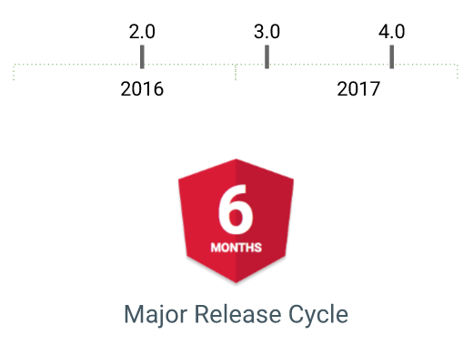

# Versioning and Releasing Angular
# Angular的版本与发布

In order for the ecosystem around Angular to thrive, developers need stability from the Angular framework so that reusable components and libraries, tutorials, tools and learned practices don’t go obsolete unexpectedly.

However, we also all want Angular to keep evolving. To achieve both goals, we’re implementing semantic versioning and new development processes to help ensure that future changes are always introduced in a predictable way. We want everyone who depends on Angular to know when and how new features are added, and to be well-prepared when obsolete ones removed.

Starting with the 2.0.0 release of Angular, we’ve adopted the following development processes:

- We use semantic versioning for signaling the content of Angular releases.
- We have moved to time-based release cycles so that you can plan ahead.
- We have a deprecation policy so that you know how to get notified of API changes ahead of time.
- We have clarified the distinction between stable and experimental APIs.
- We have clarified the scope of our Public API surface.

## Semantic Versioning

SemVer means that our version numbers are meaningful. Patch releases will not change the functionality, minor releases will contain only additive changes, and breaking changes are reserved for major releases.

## Time-based Release Cycles

In addition to using meaningful numbers for our releases, we’ve built a schedule of releases so you can plan and coordinate with the continuing evolution of Angular.

In general you can expect a patch release each week, about 3 minor updates and one major update every 6 months. We’re also baking quality into our schedule by providing Betas and RCs for each major and minor release.

We’ve been following this new schedule since our 2.0 announcement and plan to release a new minor release – Angular 2.1 – next week.

Time-based releases give eager developers access to new beta features as soon as they are ready, while maintaining the stability and reliability of the platform for production users.

## Deprecation Policy

Breaking changes are disruptive, but can be necessary in order to innovate, keep pace with changing best practices, dependencies or changes in the (web) platform itself. To make these transitions more predictable, we’re both implementing a deprecation policy, and working hard to minimize the the number of breaking changes in Angular.

We’re taking the following steps to ensure that developers have plenty of time and a clear path to update:
When we announce a deprecation via our release notes, we’ll also announce the recommended update path.
We’ll continue to support existing usage of a stable API (i.e. your code will keep working) during the deprecation period, and you’ll always have more than 6 months (two major releases) to update.
We’ll reserve any peer dependency updates with breaking changes for a major release. An example of this is that in our next major release, we’ll be updating our Typescript dependency to version 2.

## Stable vs Experimental APIs

If you browsed through our API docs, you probably noticed that we marked some of our APIs as experimental. We feel that experimental APIs are solid enough to be in production, but they require field-testing to validate that they work well for a variety of community use cases.

Experimental APIs will follow SemVer(no breaking changes outside major releases), but not our deprecation policy. If you use an experimental API, you should expect changes, some of which might not have a deprecation path. That being said, we try to minimize disruptions for our intrepid community developers and will document any API changes.

While part of our API surface is still experimental, none of the core use cases require the use of experimental APIs. Examples of experimental APIs include debugging apis, web worker support, i18n, http and animations. As these APIs mature and get more exposure in the real world, will be moving them from the experimental to stable category.
Public API Surface

Angular is a collection of many packages, sub-projects and tools. In order to prevent accidental use of private APIs and for you to clearly understand what is covered by the guarantees described in this post, we have documented what is and is not considered our public API surface.
